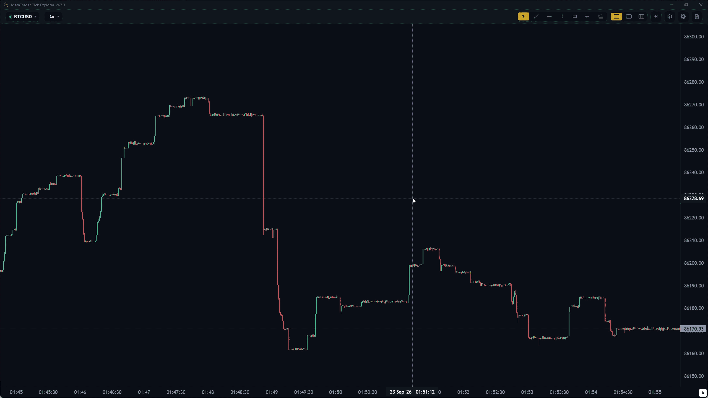
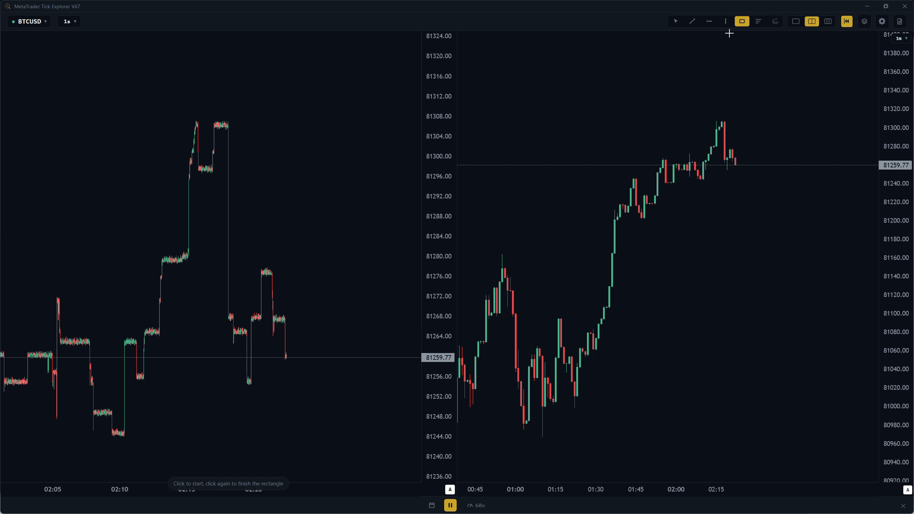
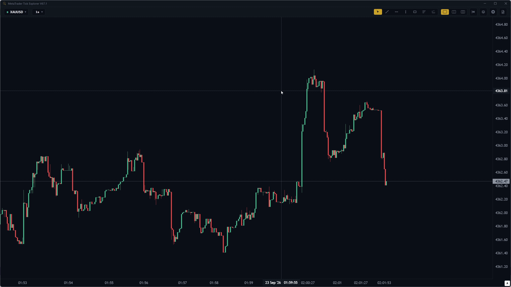

# MetaTrader Tick Explorer
English | [Farsi](README-fa.md)

MetaTrader Tick Explorer is a Windows application that extracts tick data from a local MetaTrader terminal on your machine and uses it to build second-level (and higher) candles. The data is stored directly on disk, allowing users to work with second-resolution charts on the live market as well as for any date in the past. The resulting data is rendered using the official open-source [TradingView Lightweight Charts](https://www.tradingview.com/lightweight-charts/) project.

## Features

### 1) View charts in **Replay Mode** at real live-market speed (1 tick per second), giving users a realistic simulation environment for practice.

<p align="center">
  
</p>

### 2) Use **Multi-Chart mode** to view the chart across several different timeframes at once, in both Live and Replay modes.

<p align="center">
  
</p>

### 3) Fully **offline** operation based on the stored database, for practicing on historical data.

<p align="center">
  
</p>

### 4) (Planned) Execute trades directly inside the application.


### 🔒 Security & Privacy

- **No external server:** the app talks only to the **local MetaTrader terminal** (via the official MetaTrader API for Python) — nothing is sent to any third-party service.
- **No access to account credentials:** no username, password, or other login info is ever needed; that stays with the MetaTrader terminal itself.
- **Data stays local:** all tick/candle data and settings are stored only on your own machine (see storage locations below).

### 💾 Where Data and Logs Are Stored

Where the `output` (tick/candle database, settings, etc.) and `logs` folders live depends on how the app is run:

- **Running from source (`run_chart.cmd` / developers):**
  Everything is stored inside the repository itself:
  ```text
  <repository-folder>\output\
  <repository-folder>\logs\
  ```

- **Running from the `.exe`:**
  To keep the EXE fully portable (Desktop, USB stick, any folder), data and logs are **not** written next to the EXE. Instead they go into a dedicated app folder under the Windows user's AppData:
  ```text
  %LOCALAPPDATA%\MT-TickExplorer\output\
  %LOCALAPPDATA%\MT-TickExplorer\logs\
  ```
  (This is normally equivalent to `C:\Users\<username>\AppData\Local\MT-TickExplorer\`.)

## General Prerequisites

- **Windows 10 or 11**
- **MetaTrader 5** installed, with the following conditions:
  - **Python Integration enabled** — enable it in the terminal under
    `Tools › Options › Community`.
  - **Logged in to an account** (demo or real) — without this, the broker
    provides no data to the application.

## Getting Started

### Regular Users

Download the latest `.exe` file from the project's **Releases** section and run it — no Python or any other setup is required. On the first run, the following steps take place:

### Developers

```bash
git clone <repository-url>
cd <repository-folder>
pip install -r requirements.txt
run_chart.cmd
```

## Building a Release EXE

The repository includes a reproducible PyInstaller build definition and a
Windows batch file.ensure Python,the runtime requirements, and PyInstaller are installed, then run:

```cmd
build.cmd
```

The release executable is created at:

```text
dist\MetaTrader Tick Explorer.exe
```

