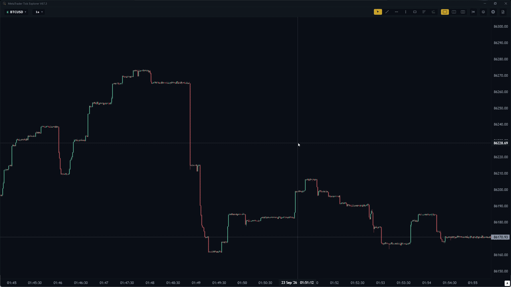
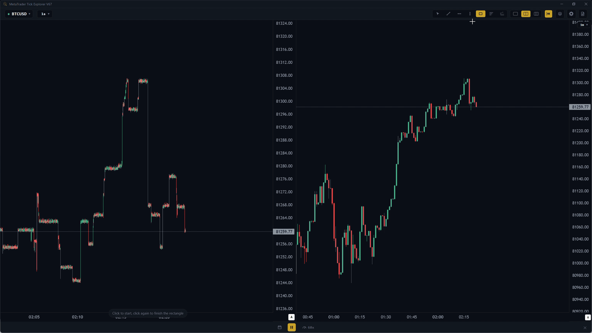
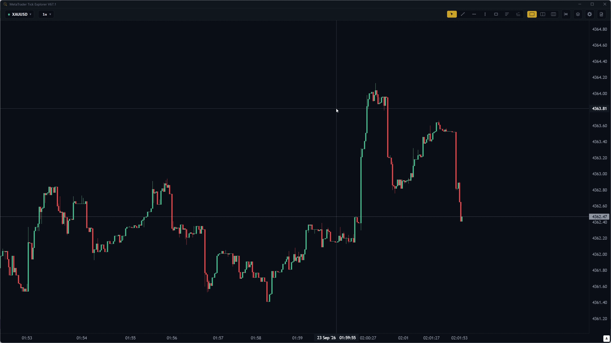
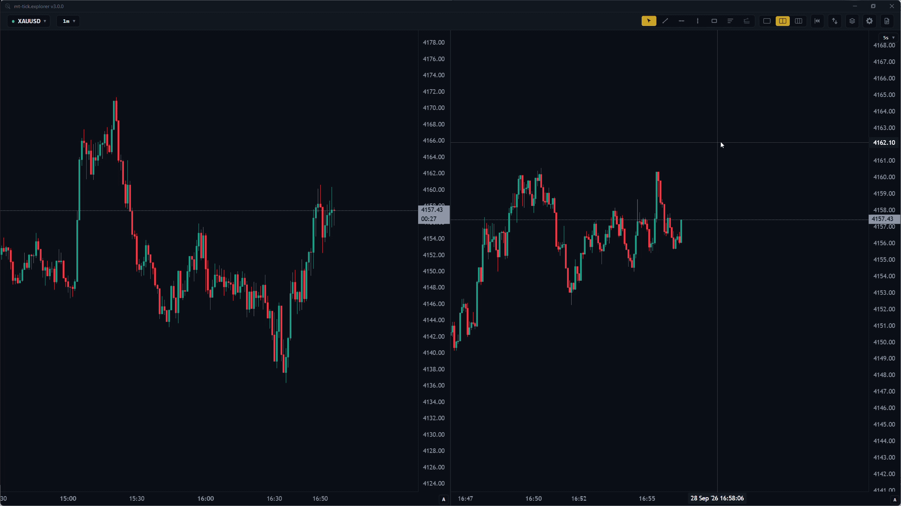

# MetaTrader Tick Explorer

English | [فارسی](README-fa.md)

[](LICENSE)

[](https://github.com/msbxcii/MetaTraderTickExplorer/releases)

**MetaTrader Tick Explorer** (`mt-tick.explorer`) is a Windows application that extracts tick data from a local MetaTrader 5 terminal on your machine and uses it to build second-level (and higher) candles. The data is stored directly on disk, so you can work with second-resolution charts on the live market as well as on any date in the past. Charts are rendered with the official open-source [TradingView Lightweight Charts™](https://www.tradingview.com/lightweight-charts/) library.

> **Not affiliated with or endorsed by MetaQuotes Ltd.** See [Trademarks](#trademarks).

## Table of Contents

- [Official Distribution & Anti-Scam Notice](#-official-distribution--anti-scam-notice)
- [Features](#features)
- [Risk Warning](#-risk-warning)
- [Security & Privacy](#-security--privacy)
- [Where Data and Logs Are Stored](#-where-data-and-logs-are-stored)
- [Requirements](#requirements)
- [Getting Started](#getting-started)
- [Building a Release EXE](#building-a-release-exe)
- [Forks & Branding](#forks--branding)
- [How to Use](#-how-to-use)
- [Contributing & Security](#contributing--security)
- [License, Attribution & Trademarks](#license)

## Features

### 1) Replay Mode
View charts at real live-market speed (1 tick per second), a realistic simulation environment for practice.

<p align="center">
  
</p>

### 2) Multi-Chart Mode
View the same symbol across several timeframes at once, in both Live and Replay modes.

<p align="center">
  
</p>

### 3) Offline History
Fully offline operation based on the stored database, for practicing on historical data.

<p align="center">
  
</p>

### 4) Trading Panel
Place and manage trades directly from the chart through your MetaTrader terminal: risk-based position sizing (percent or fixed amount), stop loss / take profit with a risk:reward setting, a maximum total-risk limit, pending orders, and live open-position lines on the chart.

<p align="center">
  
</p>

> ⚠️ Trades sent from this panel are **real orders** on whatever account your terminal is logged into. Read the [Risk Warning](#-risk-warning) first.

## ⚠️ Risk Warning

Trading forex, CFDs and other leveraged instruments carries a high level of risk and may result in the loss of all your capital.

- **You are solely responsible for every order** placed through this application, and for its outcome.
- **Always test on a Demo account first** before using the Trading Panel on a real account.
- The software may contain bugs, and connection problems, broker rejections, slippage or terminal errors can cause orders to be executed differently than intended, or not at all. Always verify your positions in the MetaTrader terminal itself.
- Nothing in this application is financial advice.
- This software is provided "AS IS", without warranties of any kind (see [LICENSE](LICENSE), sections 7 and 8). The author and contributors accept **no liability** for any trading losses.

## 🔒 Security & Privacy

- **Local terminal only:** all market data and trading go exclusively through your **local MetaTrader terminal** (via the official MetaTrader 5 Python package). Nothing is sent to any third-party service, and no external server is required.
- **The one exception, update check:** "Check for Update" makes a single read-only request to the public GitHub API to see if a newer version has been released. No personal data, account information or market data is sent. If you download an update, the new EXE is fetched from the project's GitHub Releases page.
- **No access to account credentials:** no username, password or other login info is ever needed; that stays with the MetaTrader terminal itself.
- **Data stays local:** all tick/candle data and settings are stored only on your own machine (see below).

## 💾 Where Data and Logs Are Stored

- **Running from source (`run_chart.cmd`, developers):**
  ```text
  <repository-folder>\output\
  <repository-folder>\logs\
  ```

- **Running the `.exe`:** to keep the EXE fully portable (Desktop, USB stick, any folder), data and logs are **not** written next to it but under the Windows user's AppData:
  ```text
  %LOCALAPPDATA%\MT-TickExplorer\output\
  %LOCALAPPDATA%\MT-TickExplorer\logs\
  ```
  (Normally `C:\Users\<username>\AppData\Local\MT-TickExplorer\`.)

## Requirements

- **Windows 10 or 11**
- **MetaTrader 5** installed, with:
  - **Python Integration enabled** under `Tools › Options › Community`.

     <p align="center">
     
     </p>

  - **Logged in to an account** (demo or real). Without this the broker provides no data.

## Getting Started

### Regular Users

Download the latest `mt-tick.explorer-<version>.exe` from the [Releases](https://github.com/msbxcii/MetaTraderTickExplorer/releases) page and run it. No Python or other setup is required. On the first run, the **Get Started** wizard walks you through:

1. **MetaTrader Preparation:** confirms Python Integration is enabled and the terminal is logged in.
2. **Root Project Folder:** choose where your project data and configuration will be stored.
3. **Choose Symbol:** pick a symbol from your broker's list; the app downloads the last 3 days of tick data for it (you can extend this later).
4. **All set:** the chart window opens.

> Windows SmartScreen may warn about an unsigned EXE. If in doubt, build it yourself from source (see below).

### Developers

Requires Python 3.12 (64-bit, same bitness as your MetaTrader 5 terminal).

```bash
git clone https://github.com/msbxcii/MetaTraderTickExplorer.git
cd MetaTraderTickExplorer
pip install -r requirements.txt
run_chart.cmd
```

## Building a Release EXE

The repository includes a reproducible PyInstaller build definition (`MetaTraderTickExplorer.spec`) and a Windows batch file (`build.cmd`).

```cmd
pip install -r requirements.txt -r requirements-dev.txt
build.cmd
```

The output filename is generated from `src/version.py` (`APP_NAME` + `VERSION`):

```text
dist\mt-tick.explorer-v3.0.0.exe
```

To release a new version, change `VERSION` in `src/version.py` only; the window title, build output and update check all pick it up. Tag the release commit with the same string (e.g. `git tag v3.0.0`).

## Forks & Branding

You are free to fork this project and build your own version under the terms of the Apache 2.0 license. If you publish your own build:

1. **Replace the icon:** put your own icon at `assets\Icon.ico` (and `web/assets/icon.svg`).
2. **Point Check for Update to your repository:** change `GITHUB_REPO` in `src/update_checker.py` to your own `owner/repo`. Otherwise your users will be offered the official project's releases instead of yours.
3. **Update the official notice:** edit `OFFICIAL_REPO_URL` / `FREE_NOTICE` in `src/version.py`, the notice in `web/get-started.html` and `web/About.md` so they point to your project.
4. **Use your own name:** do not present your fork as the official *MetaTrader Tick Explorer* / `mt-tick.explorer`, and change `APP_NAME` in `src/version.py`. Please keep the original copyright notice and the [NOTICE](NOTICE) file, as required by the license.

## 📊 How to Use

📘 **Full step-by-step guide: [docs/TUTORIAL.md](docs/TUTORIAL.md)**

- **Trading:** **Middle Mouse** = market order, **Shift + Middle Mouse** = pending order (re-bindable in **Settings → Keyboard Shortcuts**).

- **First load:** for every new symbol, the app pulls only the **last 3 days** of tick data so the chart is ready quickly.
- **More history:** open **Market Data Overview** and use **Extend** to backfill older data up to a target date (or **Backfill** for the default range). It runs in the background.
- **Jump to any time:** press **SPACE** to open **Jump Time** and go straight to any date/time, in Live or Replay mode.
- **Shortcuts** (customizable in **Settings → Keyboard Shortcuts**): jump to latest/oldest candle, undo/clear drawings, and quick keys for drawing tools (trend line, horizontal/vertical line, rectangle, Fib retracement/expansion).

## Contributing & Security

- Contributions are welcome, see [CONTRIBUTING.md](CONTRIBUTING.md).
- To report a vulnerability, see [SECURITY.md](SECURITY.md).

## License

Licensed under the [Apache License 2.0](LICENSE). Copyright 2026 Msbxcii.

### Attribution

Charts are powered by [TradingView Lightweight Charts™](https://www.tradingview.com/lightweight-charts/), Copyright 2023 TradingView, Inc., licensed under Apache 2.0 (see [`web/vendor/lightweight-charts.LICENSE.txt`](web/vendor/lightweight-charts.LICENSE.txt)). TradingView is a registered trademark of TradingView, Inc.; visit [tradingview.com](https://www.tradingview.com/).

### Trademarks

MetaTrader and MetaQuotes are registered trademarks of MetaQuotes Ltd. This project is an independent open-source tool and is **not affiliated with, endorsed by, or sponsored by MetaQuotes Ltd.** The name is used only to describe compatibility with the MetaTrader 5 terminal.
