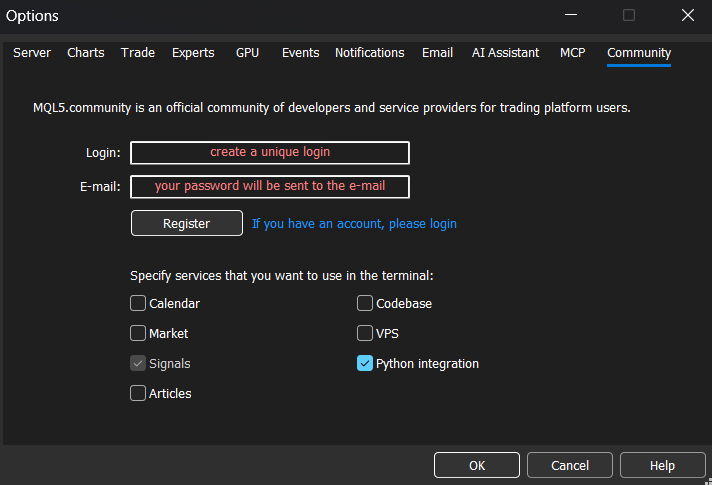

# آموزش متاتریدر تیک اکسپلورر

[English](TUTORIAL.md) | فارسی

آموزش قدم‌به‌قدم، از اولین اجرا تا معامله از روی چارت. خوندنش حدود ۱۰ دقیقه طول می‌کشه.

> ⚠️ **پنل معاملاتی رو اول روی حساب Demo تست کنید.** سفارش‌هایی که از برنامه ارسال می‌شن، سفارش واقعی روی همون حسابی هستن که ترمینال بهش لاگینه.

---

## ۱. قبل از شروع

1. **ویندوز ۱۰ یا ۱۱**
2. **متاتریدر ۵** باز و **لاگین** به یک حساب (دمو یا واقعی).
3. **فعال بودن Python Integration** در MT5: مسیر `Tools › Options › Community` ← تیک **Python integration**.

بعد فایل `mt-tick.explorer-<version>.exe` رو از بخش [Releases](https://github.com/msbxcii/MetaTraderTickExplorer/releases) رسمی دانلود و اجرا کنید. نیازی به نصب نیست.

---

## ۲. اولین اجرا (Get Started)

| مرحله | کار |
|---|---|
| **MetaTrader Preparation** | مطمئن بشید MT5 بازه، لاگینه و Python Integration فعاله. **Root Project Folder** (محل ذخیره‌ی داده‌ها و تنظیمات) رو انتخاب کنید و **Next** بزنید. |
| **Choose Symbol** | لیست نمادهای بروکر خونده می‌شه. نماد رو جستجو و انتخاب کنید (مثلاً `EURUSD`). |
| **دانلود** | داده‌ی تیک **۳ روز اخیر** دانلود و به کندل تبدیل می‌شه. |
| **All set** | چارت باز می‌شه. |

> اگه اتصال برقرار نشد، این سه مورد رو دوباره چک کنید: MT5 باز باشه، لاگین باشه و Python Integration فعال باشه.

---

## ۳. چارت

**تایم‌فریم‌ها:** `1s`، `5s`، `15s`، `1m`، `5m`، `15m`، `1h`، `4h` و `1D` از نوار ابزار.

| کار | روش |
|---|---|
| جابه‌جایی در زمان | درگ چارت یا اسکرول ماوس |
| زوم محور قیمت | درگ روی محور قیمت. **Auto Fit** اون رو به حالت اول برمی‌گردونه |
| پرش به هر تاریخ/ساعت | **Space** ← پنجره‌ی Jump Time |
| پرش به جدیدترین/قدیمی‌ترین کندل | **End** / **Home** |
| خط‌کش (زمان، پوینت، درصد) | **Shift + کلیک چپ** برای شروع، **کلیک چپ** برای پایان |

زیر برچسب قیمت لحظه‌ای، **شمارش معکوس بسته شدن کندل** نمایش داده می‌شه که بر اساس ساعت بروکره.

---

## ۴. گرفتن تاریخچه‌ی بیشتر

1. **Setting** (آیکون چرخ‌دنده) ← **Market Data Overview**.
2. قدیمی‌ترین تاریخ موجود و هیستوگرام تعداد کندل‌های هر روز رو ببینید.
3. **Extend**: یه تاریخ هدف انتخاب کنید تا برنامه در پس‌زمینه داده‌های قدیمی‌تر رو تا اون تاریخ دانلود کنه.
   **Backfill**: بازه‌ی پیش‌فرض رو پر می‌کنه.

در حین دانلود می‌تونید با چارت کار کنید. داده‌ها روی دیسک ذخیره می‌شن و فقط یک بار دانلود لازمه.

---

## ۵. ابزارهای ترسیم

خط روند، خط افقی/عمودی، مستطیل، فیبوناچی ریتریسمنت و اکستنشن.

| کار | روش |
|---|---|
| خط افقی در محل ماوس | **Ctrl + H** |
| خط عمودی در محل ماوس | **Ctrl + V** |
| بقیه‌ی ابزارها | انتخاب از نوار ابزار، بعد کلیک روی چارت |
| تغییر استایل | کلیک روی آبجکت ← منوی تنظیمات (رنگ، ضخامت، Fill، خط وسط و ...) |
| آندوی آخرین آبجکت | **Backspace** |
| حذف انتخاب‌شده‌ها | **Delete** |
| حذف همه | **Shift + Delete** (با زدن Backspace بلافاصله بعدش برمی‌گردن) |
| لغو یا خارج شدن از انتخاب | **Esc** |

**Object Tree** (آیکون لایه‌ها) لیست همه‌ی ترسیم‌هاست. می‌تونید تغییر نام بدید (دابل‌کلیک)، مخفی، قفل یا حذف کنید، توی پوشه دسته‌بندی کنید، و با **Ctrl/Shift + کلیک** چندتا رو با هم انتخاب کنید.

---

## ۶. مولتی‌چارت

۲ یا ۳ پنل از **همون نماد** با تایم‌فریم‌های مختلف باز کنید (مثلاً 1m + 15s + 1h). هر پنل تایم‌فریم، ترسیم‌ها و کراس‌هیر خودش رو داره. با **Maximize** یه پنل بزرگ می‌شه و **Esc** برش می‌گردونه. هم در Live کار می‌کنه و هم در Replay.

---

## ۷. Replay (تمرین روی گذشته)

1. **Replay** رو باز کنید و با **Select Date** نقطه‌ی شروع رو انتخاب کنید. کندل‌های بعد از اون نقطه مخفی می‌شن.
2. **Play** بزنید. به‌طور پیش‌فرض کندل‌ها با سرعت واقعی بازار ساخته می‌شن.
3. **Replay Speed**: `1x`، `5x`، `10x`، `30x` یا `60x`.
4. با **Close Replay** به حالت Live برمی‌گردید.

> در حالت Replay، معامله و کلید **End** غیرفعالن تا داده‌ی لایو وارد تمرین نشه.

---

## ۸. معامله از روی چارت

### ۸.۱ تنظیم ریسک (پنل Trade)

پنل **Trade** (آیکون هدر) ← تب **Trade**:

- **ریسک هر معامله**: درصدی از بالانس یا مبلغ ثابت. حجم (لات) خودکار محاسبه می‌شه.
- **کمیسیون**: به ازای هر لات. توی محاسبه‌ی حجم لحاظ می‌شه.
- **R:R**: فاصله‌ی حد سود به‌صورت ضریبی از فاصله‌ی حد ضرر.
- **Max risk**: سقف مجموع ریسک پوزیشن‌های باز. سفارش‌هایی که از این سقف رد بشن ثبت نمی‌شن.

### ۸.۲ سفارش مارکت

1. **کلیک وسط ماوس** روی چارت ← خط حد ضرر دنبال ماوس حرکت می‌کنه و خط حد سود هم با نسبت R:R همراهش میاد.
   - حد ضرر **زیر** قیمت = **خرید (Buy)**، **بالای** قیمت = **فروش (Sell)**.
2. **کلیک چپ** ← سفارش ارسال می‌شه.
3. برای لغو: **کلیک راست**، **Esc** یا دوباره **کلیک وسط**.

### ۸.۳ سفارش پندینگ

1. **Shift + کلیک وسط**.
2. **کلیک چپ اول** قیمت ورود رو قفل می‌کنه و **کلیک چپ دوم** حد ضرر رو مشخص و سفارش رو ثبت می‌کنه. نوع سفارش (Limit یا Stop) خودکار انتخاب می‌شه.

### ۸.۴ مدیریت پوزیشن‌ها

- خطوط SL/TP پوزیشن باز رو روی چارت **درگ** کنید. تغییر بعد از رها کردن ماوس به MT5 ارسال می‌شه.
- توی پنل Trade، هر پوزیشن دکمه‌های **Risk-free**، **Close 25%**، **Close 50%** و **Close** داره. سفارش‌های پندینگ دکمه‌ی **Cancel** دارن.
- تب **History** معاملات بسته‌شده رو با سود/زیان خالص، درصد برد و کارمزدها نشون می‌ده.

سفارش‌ها در تاریخچه‌ی MT5 با کامنت `mt-tick.explorer` ثبت می‌شن.

> همیشه پوزیشن‌ها رو توی خود ترمینال MT5 هم چک کنید.

---

## ۹. شخصی‌سازی

**Setting** (آیکون چرخ‌دنده):

| تب | کاربرد |
|---|---|
| **Market Data Overview** | تاریخچه، Extend و Backfill |
| **Canvas** | رنگ‌ها و تم چارت، قابل ذخیره به‌صورت Preset |
| **Keyboard Shortcuts** | تغییر همه‌ی شورتکات‌ها، از جمله **کلیک وسط** و **Shift + کلیک وسط** برای معامله (با کلید کیبورد یا دکمه‌ی وسط/Back/Forward ماوس) |
| **Configuration** | تنظیمات برنامه |
| **About** | نسخه‌ی برنامه و **Check for Update** |

تغییر شورتکات: روی ✎ کلیک کنید، کلید یا دکمه‌ی ماوس جدید رو بزنید و بعد ✓ رو بزنید. شورتکات‌ها بر اساس جای فیزیکی کلیدها کار می‌کنن، پس با کیبورد فارسی هم فرقی نمی‌کنه.

---

## ۱۰. خلاصه‌ی شورتکات‌ها

| شورتکات | کار |
|---|---|
| Space | Jump Time |
| End / Home | جدیدترین / قدیمی‌ترین کندل |
| Ctrl + H / Ctrl + V | خط افقی / عمودی |
| Backspace | آندوی آخرین آبجکت |
| Delete / Shift + Delete | حذف انتخاب‌شده / حذف همه |
| Shift + کلیک چپ | خط‌کش |
| کلیک وسط | سفارش مارکت |
| Shift + کلیک وسط | سفارش پندینگ |
| کلیک راست / Esc | لغو |

---

## ۱۱. رفع مشکلات

| مشکل | راه‌حل |
|---|---|
| اتصال برقرار نمی‌شه یا نمادی نمیاد | MT5 رو باز کنید، لاگین کنید و Python Integration رو فعال کنید |
| قیمت لحظه‌ای نمیاد | بازار بسته‌ست یا اتصال MT5 به بروکر قطع شده |
| چارت فقط چند روز داده داره | از **Extend** استفاده کنید (بخش ۴) |
| دکمه‌های معامله کار نمی‌کنن | مجاز بودن معامله روی حساب رو چک کنید و مطمئن بشید Replay بسته‌ست |
| بقیه‌ی مشکلات | پنل **Log** (هدر) رو باز کنید و لاگ رو توی یه [Issue](https://github.com/msbxcii/MetaTraderTickExplorer/issues) بفرستید |

داده‌ها و لاگ‌ها در مسیر `%LOCALAPPDATA%\MT-TickExplorer\` ذخیره می‌شن.

---

*این برنامه رایگانه. اگه براش پول دادید، کلاهبرداری بوده. منبع رسمی: [github.com/msbxcii/MetaTraderTickExplorer](https://github.com/msbxcii/MetaTraderTickExplorer). این پروژه هیچ ارتباطی با MetaQuotes نداره.*

